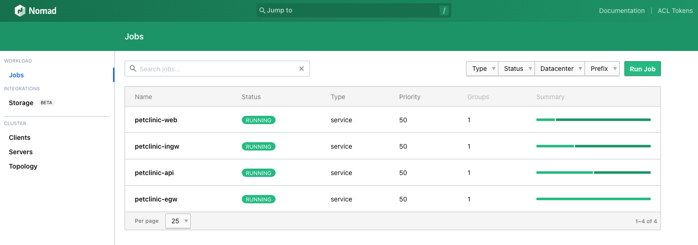
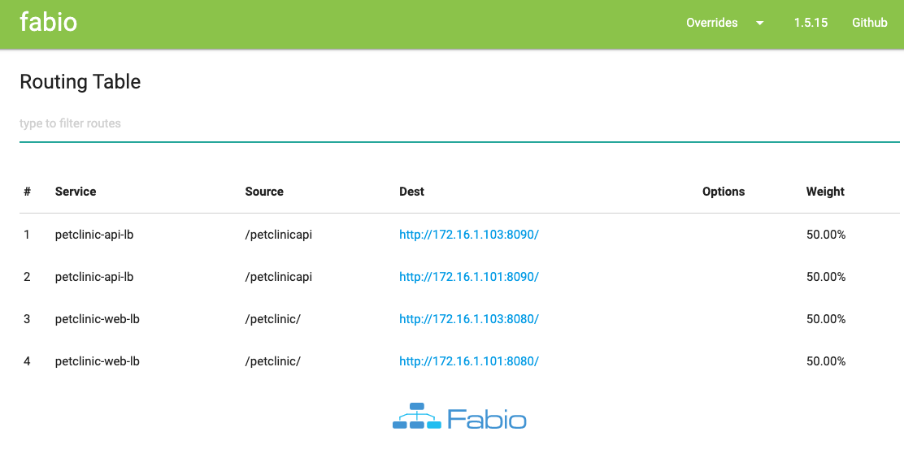
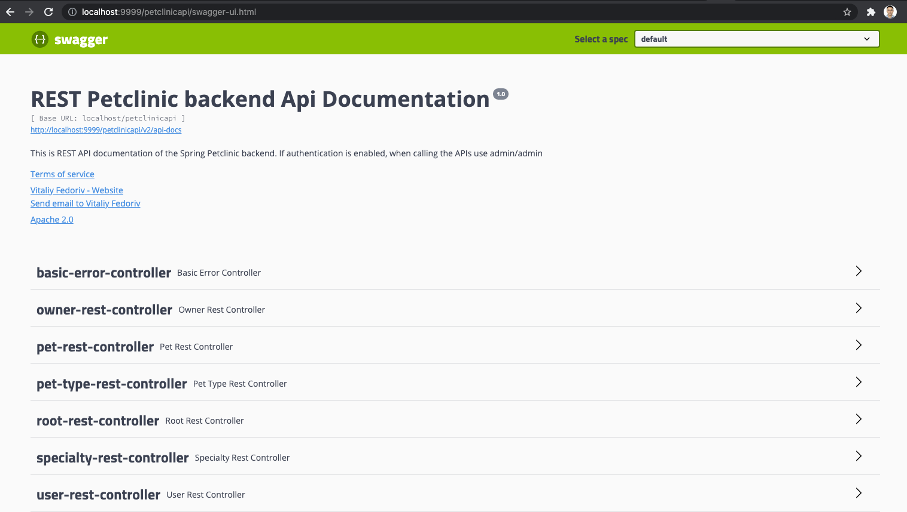
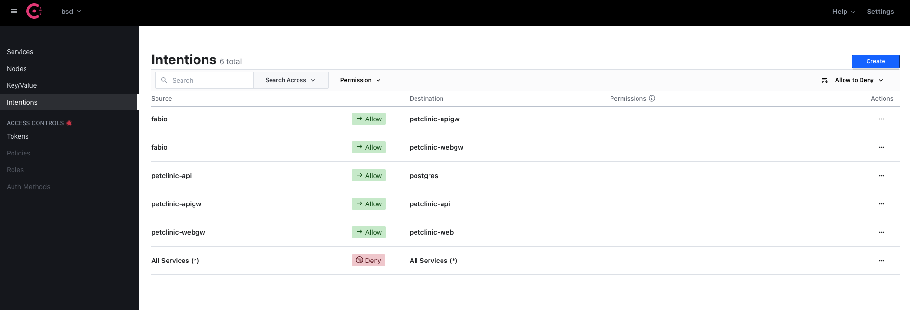
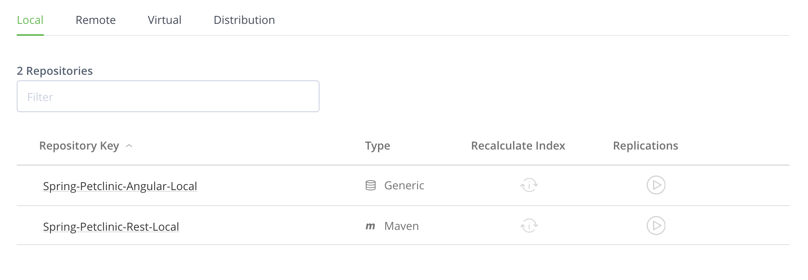
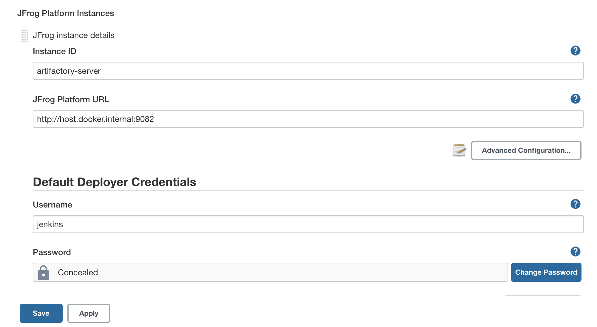
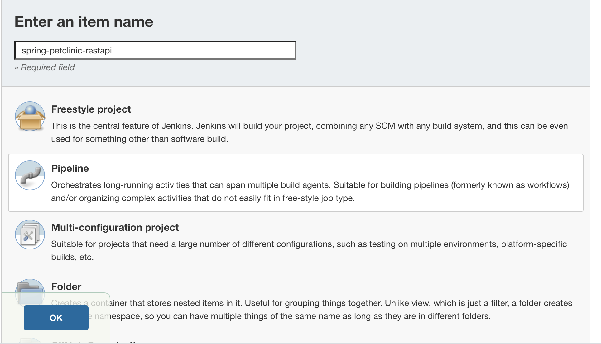

# Set up a 3 Tier App using Nomad and Consul

## Why this tutorial?

Although there are many tutorials in the internet, a tutorial explaining a realistic multi-tier application working on Nomad and Consul is very rare. It took us a while to learn all the various pieces of the Nomad/Consul ecosystem and hope this tutorial helps the community to jump start their journey on the same.

We will be using the classic spring-petclinic app (https://github.com/spring-petclinic) to demo the setup using Nomad and Consul.

This tutorial will include the following:
1. Setup an Nginx server running on Nomad to serve html, js, images etc built using AngularJs. The Nginc server will have envoy as a sidecar for service mesh.
2. Setup a springboot rest api running on Nomad. This workload will have envoy as a sidecar for service mesh.
3. Setup an envoy ingress gateway to communicate with the web and rest services using mTLS and provide a way of internally load balancing the instances of web and rest services. 
4. Setup a terminating gateway to route traffic outside the cluster
5. Setup an PostgreSQL DB outside the Nomad cluster which gets traffic from the cluster via the terminating gateway.
6. Setup Fabio to load balance the ingress gateways for HA.

## Pre-requisites

Setting up this on your local machine assumes the following pre-requisities:

- Hashicorp Vagrant installed on your local machine and available in your path
- Oracle Virtualbox installed
- git client installed
- Docker is running in your laptop. For mac, Docker Desktop would be ideal.

*Not tested in Windows but should work as it is or with some minor tweaks*

## Why Vagrant?

The idea behind this tutorial was to get something realistic working on your own desktop or laptop without needing to setup an environment in cloud. Vagrant provides a good way to create multiple nodes and play out the actual scenarios. That being said, this tutorial can easily be migrated to the cloud. Feel free to fork it or ping us to contribute on cloud specific tutorials.
## Download the Repo first

	git clone https://github.com/nairnavin/practical-nomad-consul.git

## Change the directory to the Repo folder

	cd nomad-vagrant-lab
    vagrant up

## Quick check if everything works

Once the provisioning is over, you should be able to connect via http://localhost:4646 for Nomad UI and http://localhost:8500 for consul UI. Optionally, the nomad and consul UI should also be accessible from the cluster server IP - 172.16.1.101

To connect to the machine via ssh, use the vagrant ssh command:

    vagrant ssh server-dc1-1
    vagrant ssh client-dc1-2
    vagrant ssh client-dc1-3

For simplicity, the server and clients are in the same subnet.

## Set up the PostgreSQL database in your local machine so that it simulates a DB outside the vagrant (nomad/consul) cluster
### 1. Run postgresql using docker
    docker run --name postgresdb -e POSTGRES_USER=postgres -e POSTGRES_PASSWORD=postgres -e POSTGRES_DB=petclinic -p 5432:5432 -d postgres
### 2. Initialize the database 

Use the table creation and data insert scripts external-services/init-db/initDB.sql and external-services/init-db/populateDB.sql, set up the tables and some test data. You can use pgadmin or psql for the task.

If you have postgresql client in your laptop, you can use the following commands:

    psql -h 127.0.0.1 -d petclinic -U postgres -f external-services/init-db/initDB.sql
    psql -h 127.0.0.1 -d petclinic -U postgres -f external-services/init-db/populateDB.sql

## Set up the Terminating Gateway
### 1. Register external postgres service in consul. 
    curl --request PUT --data @external-services/postgres.json 172.16.1.101:8500/v1/catalog/register

> Note: The 'Address' field in the postgres.json is configured with 10.0.2.2 which is the IP of the host machine mapped by vagrant from within the cluster. If there are issues connecting the rest api to the postgresql, one quick troubleshooting step would be to ssh into the vagrant server box and try connecting to the postgres at 10.0.2.2:5432. If it doesn't work, you may need to figure out the host ip on which the docker machine is running on your laptop.

### 2. Deploy terminating gateway job
    nomad job run jobs/cli-jobs/petclinic-egw.nomad

## Run the web and api services 
    nomad job run jobs/cli-jobs/petclinic-api.nomad
    nomad job run jobs/cli-jobs/petclinic-web.nomad

## Run the ingress gateways
    nomad job run jobs/cli-jobs/petclinic-ingw.nomad

With this, your nomad cluster should be up and running with 2 instances of ingress/terminating gateway and 2 instances of web and api services. To confirm everything works, you can point your browser to http://172.16.1.101:4646 for the nomad jobs and http://172.16.1.101:8500 for consul services. 

## Lets setup Fabio as a load balancer for the ingress gateways

    chmod +x launch-fabio-lb.sh
    ./launch-fabio-lb.sh
## Time to check out the petclinic app running in Nomad cluster and using Consul connect for service mesh

The fabio load balancer will automatically go to consul and update itself with the URL for the ingress gateways. The ingress gateway provide an end point to the underlying api and web services running on worker nodes. 

The fabio registered services can be accessed via http://localhost:9998

The petclinic app can be accessed via http://localhost:9999/petclinic/

The petclinic api can be accessed via http://localhost:9999/petclinicapi/

## Play around with consul intentions

Consul connect provides for a service to service authn/authz using a combination of mTLS and consul intentions. You can read about intentions in the consul documentation. If you want to play around with intentions, you can set up something like the image below to ensure only specific services talk to each other and the default is deny all

## Install Jenkins to setup a pipeline

    cd jenkins-docker
    docker build -t jenkins:local .
    docker run -p 8080:8080 -p 50000:50000 -v ~/jenkins_home:/var/jenkins_home jenkins:local

Once your run the above docker run command, Initial admin password will be generated and copy it. Post which you can access the jenkins url via http://localhost:8080/ and paste the initial admin password which is generated in terminal. Install all the suggested plugins and post which create your admin username and password
## Install JFROG to create a local binary Repo 

    docker run -d --name artifactory -p 9082:8082 -p 9081:8081 -v artifactory-data:/var/opt/jfrog/artifactory releases-docker.jfrog.io/jfrog/artifactory-oss:latest

- Access the JFROG url via http://127.0.0.1:9082/

- Login with default one--> **username**: admin  **password**: password (**Note:** You can change after you login) 

- Create the service username for Jenkins in JFROG repo under admin tab --> **username**: jenkins  **password**: Admin@123 

- Create the two local repository in JFROG  as shown in below name and repository type         `(**Spring-Petclinic-Angular-Local, Spring-Petclinic-Rest-Local**)

## Install and Configure Artifactory Plugin in Jenkins 

- Install Plugins: Go to Manage Jenkins --> Manage Plugins --> Search for "Artifactory" and Install it. 

- Configure Artifactory: Go to Manage Jenkins --> Configure Systems. You would find JFROG and Add JFROG Platform instance like below. 

Instance ID: **artifactory-server**
JFROG Platform URL : **http://host.docker.internal:9082**
Username: **jenkins**
password: **Admin@123**

# Now Start Creating the pipeline and play around in Jenkins

### 1. Create the Spring Petclinic Restapi pipeline

- Under Jenkins Dashboard, Click on New item and name the pipeline as **spring-petclinic-restapi** and select the option as  pipeline script shown in below

- Go to Pipeline Tab and select a option **Pipeline Script from SCM** under defintion and provide the restapi git url https://github.com/nairnavin/spring-petclinic-restapi.git as below screenshot

- Now save the pipeline and start triggering **Build Now Option**

### 2. Similarly create the pipeline for Spring Angular github and name the pipeline as _spring-petclinic-angular_ 
- https://github.com/nairnavin/spring-petclinic-angular.git

### 3. Create the Jenkins pipeline for _practical-nomad-consul_

- Git URL https://github.com/nairnavin/practical-nomad-consul.git

- Jenkins Job name should be **practical-nomad-consul** (This is very important CI pipeline will trigger this pipeline using Job Name) and configure **Pipeline Script from SCM** 

- Pipeline script path should be **pipeline-scripts/Jenkinsfile** as shown in below and branch should be **main**

# Stop the Nomad Jobs which is created manually before triggering the pipeline 

    $ nomad stop -purge petclinic-web
    $ nomad stop -purge petclinic-api

# Trigger the Jenkins pipeline  

- Go into **spring-petclinic-restapi** Jenkins job and click Build Now.

- Restapi pipeline will automatically trigger the **_practical-nomad-consul_** job and post that go into the **_practical-nomad-consul_** job and approve the pipeline manually for Nomad Deployment.

- Follow the above steps for trigerring **_spring-petclinic-angular_** job

Access the petclinic Web  using http://localhost:9999/petclinic/

## Cleanup resources
### To stop the machines, use
    vagrant halt
    
### To destory all resources use

	vagrant destroy
## Credits

Like always, this tutorial stands on the shoulders for other brilliant people who have shared their knowledge with the world. Calling out few of the main tutorials and content that was referred to during the creation of this tutorial

- https://learn.hashicorp.com/nomad for tutorials and content on Hashicorp Nomad
- https://learn.hashicorp.com/consul for tutorials and content on Hashicorp Consul
- https://github.com/spring-petclinic for petclinic demo app
- https://github.com/discoposse/nomad-vagrant-lab for the vagrant lab setup

The authors may have referred & read many more articles and blogs during the research and we thank each one of them for sharing their learnings with us. Although there are too many to cite, we hope this tutorial is a way of honouring them and our contribution back to the community.

