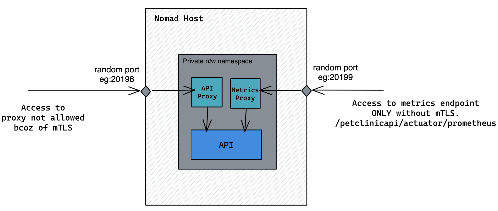
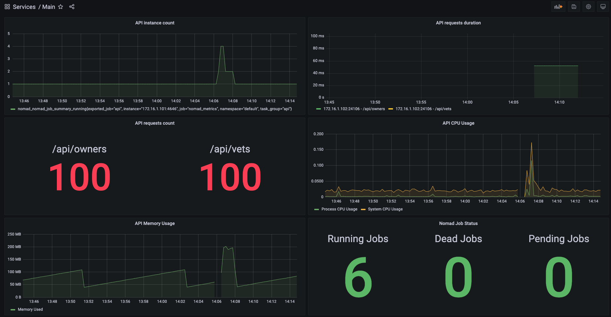

# How to

Assuming the VMs are already provisioned using the Vagrantfile in the root and Nomad/Consul is installed and configured as explained in the README in the root directory. Following jobs can also be deployed as explained in the README, which make sure the petclinic application is running and can be accessed via `http://localhost:9999/petclinic/`.

- petclinic-api
- petclinic-web
- petclinic-ingw
- petclinic-egw

## Monitoring

For monitoring purpose, we are going to use Prometheus and it can be installed as a Nomad job within the cluster.

```
nomad job run jobs/prometheus.nomad
```

This starts a prometheus server and this can accessed through the Fabio load balancer because of the `urlprefix` configuration in service tags.

```
      service {
        name = "prometheus"
        port = "prometheus_ui"
        tags = ["urlprefix-/"]
        ...
      }
```

Prometheus is available in `http://localhost:9999/`. In this exampe, we are going to have Grafana outside ther cluster. Grafana is configured as docker container using docker compose. Run the following command within `monitoring-autoscaling` folder to spin up the grafana.

```
docker-compose up -d
```

# Monitoring

The Nomad agent collects various runtime metrics about the performance of different libraries and subsystems. These metrics are aggregated on a ten second interval and are retained for one minute.

This data can be accessed via an HTTP endpoint or via sending a signal to the Nomad process. This data is available via HTTP at `/metrics`. The metrics can be enabled in the agents using below configuration.

```
telemetry {
  collection_interval = "1s"
  disable_hostname = true
  prometheus_metrics = true
  publish_allocation_metrics = true
  publish_node_metrics = true
}
```

## Prometheus

Prometheus is used to scrape the metrics from the agents and store it in a time series database. Prometheus can be deployed into the cluster through a Nomad job. The job uses a Prometheus docker image. The job is located in [Prometheus Nomad Job](./prometheus.nomad).

Prometheus has to be configured to scrap nomad metrics using the below configuration. Nomad agents expose an endpoint `/v1/metrics` for metrics scraping.

```
scrape_configs:

  - job_name: 'nomad_metrics'
    consul_sd_configs:
    - server: '172.16.1.101:8500'
      services: ['nomad-client', 'nomad']

    relabel_configs:
    - source_labels: ['__meta_consul_tags']
      regex: '(.*)http(.*)'
      action: keep

    scrape_interval: 5s
    metrics_path: /v1/metrics
    params:
      format: ['prometheus']
```

The Nomad client emits metrics related to the resource usage of the allocations and tasks running on it and the node itself. We will use one of the metrics to do the autoscaling, which we will discuss later.

### Spring boot metrics

In addition to Nomad metrics, Prometheus can be used to scrape metrics from Spring boot application. Metrics can be enabled in Spring boot using additional dependencies. More information to configure spring boot actuator metrics available [here](https://docs.spring.io/spring-boot/docs/current/reference/html/actuator.html#actuator.metrics).

Once spring boot metrics are configured, individual instances of petclinic-api service serve metric information throught his endpoint - `/petclinicapi/prometheus/actuator`. But this endpoint cannot be reached from prometheus, since API service is running within the consul service mesh. Only another service with the mesh can reach it through sidecar proxy, since the proxy does mTLS authentication.

To solve this problem, Nomad offers one more option called `expose` stanza within consul connect configuration.

https://www.nomadproject.io/docs/job-specification/expose#expose-examples

```
expose {
    path {
        path             =  "/petclinicapi/actuator/prometheus"
        protocol         =  "http"
        local_path_port  =  9966
        listener_port    =  "metrics"
    }
}
```

This configuration spins up one more sidecar proxy with a random port named listener on host and allows only `/petclinicapi/actuator/prometheus` endpoint. All other endpoints would return 404.



Now prometheus can be configured to scrape metrics from this endpoint. Since prometheus doesn't know the port of the metrics proxy, this has to be passed to prometheus somehow. This is where [Nomad environment variables](https://www.nomadproject.io/docs/runtime/interpolation#interpreted_env_vars) are really useful. The named ports are usually available in the environment variable `NOMAD_PORT_<label>`. In our case, it would be `NOMAD_PORT_metrics`. The instance might be running in any of the Nomad hosts, so IP is not constant. So we can use the variable `NOMAD_HOST_ADDR_metrics`, which has both IP and port. This value can be sent to Prometheus through service tag as below.

```
service {
      name = "api"
      tags = [ "addr:${NOMAD_HOST_ADDR_metrics}" ]
      port = "9966"
      ...
}
```

From prometheus configuration, this value can be extracted using the relabel configuration. The tag has been retrieved using the regex capture and replaced into '\__address\__' attribute.

```
  - job_name: 'actuator'
    metrics_path: /petclinicapi/actuator/prometheus
    consul_sd_configs:
    - server: '172.16.1.101:8500'
      services: ['api']
      
    relabel_configs:
    - source_labels: ['__meta_consul_tags']
      regex: ',addr:(.*),'
      target_label: '__address__'
      replacement: '$1'
      action: replace

    scrape_interval: 5s
    params:
      format: ['prometheus']
```

### Access Promethues

Prometheus can be accessed through Fabio load balancer. Fabio can be configured to run outside Nomad cluster using the docker compose file located [here](../../docker-compose.yml). Fabio automatically pick up the services as backend, whichever has the tag `urlprefix-`. The confid looks like below.

```
service {
    name = "prometheus"
    port = "prometheus_ui"
    tags = ["urlprefix-/"]
    ...
}
```

Now the prometheus can be access through http://localhost:9999/. Verify the Status -> Targets menu in prometheus to check whether all metrics endpoints are up.

## Grafana

Once prometheus is configured to scrape metrics, Grafana can be used to create monitoring dashboards using the prometheus data. In this example, grafana is running outside the cluster and connect to prometheus server running inside the cluster. Grafana can be deployed using the docker compose file in this [location](./docker-compose.yml).

Grafana has to be configured to talk to prometheus. The below configuration does that.

```
apiVersion: 1

datasources:
  - name: Prometheus
    type: prometheus
    access: direct
    url: http://localhost:9999
    jsonData:
      httpMethod: POST
```

The daahboard configuration for Grafana is also available in the format of JSON [here](./grafana/dashboard.json). On accessing grafana at `http://localhost:3000/`, you will see something like below.



# Autoscaling

Nomad task instances can be scaled out to handle more traffic. Nomad uses a plugin called [nomad-autoscaler](https://github.com/hashicorp/nomad-autoscaler) to do this. The Nomad Autoscaler currently supports Horizontal application autoscaling, cluster autoscaling and dynamic application sizing. In the example, we focus on horizontal application autoscaling.

Nomad autoscaler need metrics data to take decisions on auto scaling. It can talk to Prometheus to get the data for auto scaling. Autoscaler has to be configured like below,

```
nomad {
  address = "http://172.16.1.101:4646"
}
telemetry {
  prometheus_metrics = true
  disable_hostname   = true
}
apm "prometheus" {
  driver = "prometheus"
  config = {
    address = "http://{{ range service "prometheus" }}{{ .Address }}:{{ .Port }}{{ end }}"
  }
}
strategy "target-value" {
  driver = "target-value"
}
```

The scaling requirements has to be configured in individual jobs. In this example, lets configure autoscaling for petclinic-api. Lets say we want to increase the instance count whenever there is an increase in CPU usage.

```
    scaling {
      min     = 1
      max     = 4
      enabled = true

      policy {
        evaluation_interval = "2s"
        cooldown            = "5s"

        check "cpu_usage" {
          source = "prometheus"
          query  = "avg(nomad_client_allocs_cpu_total_percent{task='api'})"

          strategy "target-value" {
            target = 50
          }
        }
      }
    }
```

Based on this configuration, the autoscaling will be triggered when the average CPU usage goes beyond 50%. The load can be simulated using the tool [hey](https://github.com/rakyll/hey). The below command uses 5 concurrent jobs and generates 200 requests per job for next 1 minute.

```
hey -z 1m -c 5 http://localhost:9999/petclinicapi/api/owners
```

After running this command, you can observe the instance count in either Nomad or Grafana dashboard. The autoscaling configuration demonstrated here is for sample purpose and it might differ in real time based on the requirement.